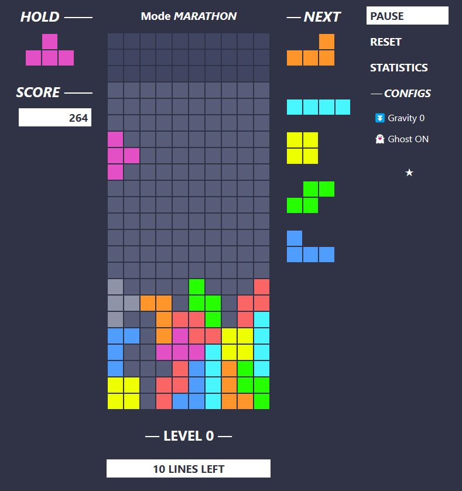

#  tetris-ie 

인터넷 익스플로러에서도 완벽히 동작하는 싱글 플레이어 테트리스!

🕹️ [지금 플레이해보세요!](https://zer0ken.github.io/tetris-ie/)

### 조작법

* 게임 내 조작
  * 우로 이동: `Arrow Right`
  * 좌로 이동: `Arrow Left`
  * 시계방향 회전: `Arrow Up`, `X Key`
  * 반시계방향 회전: `Left Ctrl`, `Z Key`
  * 홀드: `Left Shift`, `C Key`
  * 소프트 드랍: `Arrow Down`
  * 하드 드랍: `Space`
* 일시정지: `Q Key`, `Esc`
* 초기화: `R Key`
* 통계: `S Key`

---
